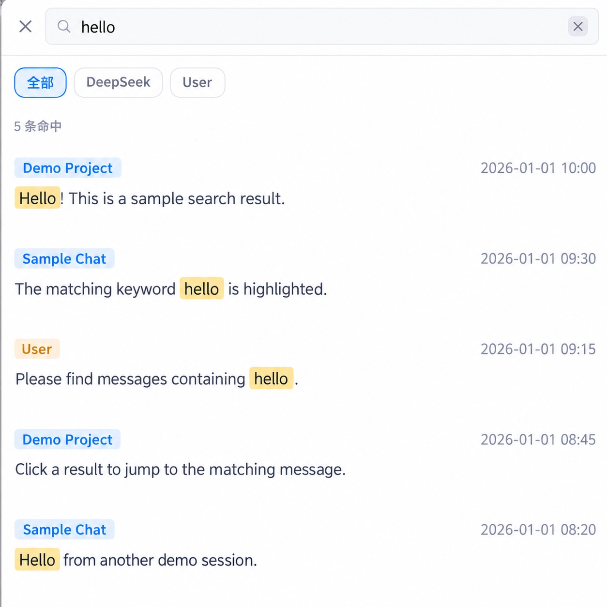

# dsh-session-search

给 [DeepSeek Harness](https://github.com/deepseek-ai/deepseek-harness)（DSH）加一个**会话全文搜索浮窗**：侧边栏一个放大镜入口，按关键词搜你 DSH 里的**全部历史会话**；点击某条命中后，**打开该会话并精准定位到那条消息所在行，并高亮几秒**（User 消息定位到用户消息行，DeepSeek 回复定位到回复行）。



*浮窗效果：输入关键词 → 跨会话命中按会话分组、按时间倒序 → 点击任一条即跳转到该消息并高亮。*

## 功能

- 侧边栏**左下角**（"设置"按钮附近）出现 **🔍** 入口；
- 点击弹出搜索浮窗，左上角 **✕** 关闭 / 点遮罩 / Esc 关闭；
- 搜索框输入关键词 → 300ms 防抖实时搜索；
- **对话方筛选**：全部 / DeepSeek / User；
- 结果**按时间倒序**（最近的会话、最近的消息在前），每条带**具体时间**（MM-DD HH:mm）；
- **无关键词默认界面**：显示所有会话（标题 + 各自一条 User / 一条 DeepSeek 消息样例）；
- 命中内容**关键词高亮**，只显示命中句附近片段（不一只坨）；
- **点击命中 → 打开会话 → 自动加载历史分页 → 定位到该条消息行 → 滚动定位 + 高亮几秒**；
- 跳转后浮窗自动关闭。

## ⚠️ 隐私与安全（请先读）

**这个插件会读取并展示本机 DSH 的全部历史会话正文。** 会话内容通常是高度私密的，请务必了解：

1. **数据来源**：主机端直接读取 `${DSH_HOME:-~/.dsh}/sessions/**/session.jsonl.zstd`，即你 DSH 的所有会话原文。不上传、不联网、不写入任何新文件（零第三方依赖，只用 Node 内置模块）。
2. **HTTP 接口**：通过 DSH 的 `ctx.webServer` 暴露 `GET /api/dsh-session-search`，**返回会话正文**。接口加了**回环限制**（`Host` 与 `remoteAddress` 均为 `localhost` / `127.x` / `::1` 才放行，其余 `403`）。
3. **⚠️ 这只是一层附加防护，不是可靠鉴权。** 请勿把它当成访问控制：
   - 同一台机器上，任何能访问该端口的进程或网页都可能读到会话内容；
   - 本地反向代理 / 端口转发可能让**外部请求表现为回环来源**，从而绕过这道检查。
4. 因此务必：
   - **不要**把 DSH Web 暴露到公网或不可信网络（不要用 `--host 0.0.0.0` 之类对外监听）；
   - 在共享电脑上使用前自行评估风险。
5. 本插件**不发送任何遥测**，**不发起外部网络请求**。

## 环境要求

- **Node.js ≥ 22.15.0** —— `zstdDecompressSync`（`node:zlib`）自 **22.15.0** 起提供，且目前仍被标记为**实验性 API**（未来 Node 版本行为可能有变化）。`package.json` 已声明 `engines.node`。
- **DeepSeek Harness** —— 已在以下宿主上人工验证：
  - `dsh web` **0.1.x**（`0.1.1-rc.2`，本插件最初开发所针对的版本）
  - **官方桌面端（DSH Desktop）** 与 0.2+ 的 `dsh web`
- **浏览器**：Chrome / Edge / Safari / Firefox 最新版

### 依赖的 DSH 客户端契约

| 用途 | 契约 | 版本差异 |
| --- | --- | --- |
| **切换会话** | `uiWorkspace.openSession(sessionId)` | **0.2+ / 桌面端**用这个；**0.1.x** 用 `sessions.open(sessionId)` |
| **加载历史分页** | `sessions.binding(sessionId).session.loadOlder()` | 未见变化 |
| **定位锚点** | `[data-conversation-scroll]`、`[data-chat-anchor-key]` DOM 属性 | 未见变化 |

> `sessions` 服务在 0.2+ 上只提供 `binding` / `retainInfo` / `scopeOf` / `scope` / `fork` / `push` / `map` / `subagentAddress` / `using` / `sessionOf`，**不再有 `open`**。会话切换被移到了 `uiWorkspace` 服务上。


## 响应规模上限

搜索结果**不是无界的**（避免超大 JSON 响应拖慢 DSH）：

- 每条命中只返回**命中词周边的片段**（上限 **300** 字符，超出以 `…` 包裹并置 `truncated: true`），不回整段正文；
- 单次搜索最多返回 **200** 条命中（`matchLimit`）、**50** 个会话分组（`groupLimit`）；
- 无关键词的"全部会话"列表同样限制为最新 **50** 个会话，样例文本也会截断；
- 响应带 `groupTotal` / `matchLimit` / `groupLimit` 字段，UI 可据此提示"结果已截断"；
- 关键词长度上限 **500** 字符。

## 实现要点（精准定位）

DSH 对话是**分页懒加载**的（打开会话默认只渲染最新页，历史消息不在 DOM），所以不能直接用 `scrollIntoView` 定位到任意一条历史消息。本插件参考社区 [`dsh-convmap`](https://github.com/GeekRicardo/dsh-convmap) 验证过的机制：

1. **数据层**：主机端直读会话文件（`node:zlib` 按 Zstandard 帧解压成 JSONL），解析出会话标题 + 每条 user/ds 消息（含时间），做本地全文搜索。不依赖 DSH 的 `session.search` 索引。
2. **定位层**：打开会话后，通过 `sessions.binding(sessionId).session.loadOlder()` **循环加载历史分页**，直到目标消息渲染进 DOM；再用 `[data-chat-anchor-key]` 行 + 关键词**文本节点**匹配定位到那一行，`scrollIntoView` + 淡化高亮。
3. **高亮实现**：只对**文本节点**做替换（`TreeWalker` + `textContent`），**不改写 `innerHTML`** —— 否则关键词若恰好匹配到属性名/标签名（例如搜索 `div`、`class`）会破坏页面结构。

关键：DSH 每条消息行带 `data-chat-anchor-key` 锚点（user / assistant 消息都有），所以**从哪条消息点进去，就能精准定位到哪一行**。

## 安装

### 方式一：`dsh plugin add`（推荐，自动注册）

本插件自带 `dsh.bundle.patch`（指向仓库内的 `cordis.patch.yml`），因此安装时会**自动把插件行 insert 进 profile**，不需要手工编辑 profile 配置。

```sh
# 1. 放到稳定位置
mkdir -p ~/.dsh/plugins
cp -R dsh-session-search ~/.dsh/plugins/

# 2. 安装：--profile 填你实际在用的那个
#    dsh web 用户 → web ；官方桌面端 → desktop
dsh plugin --profile web add link:~/.dsh/plugins/dsh-session-search

# 3. 重启对应宿主生效
```

> `dsh plugin add` 依赖 pnpm。若 `pnpm install` 不认 `link:` 依赖（表现为 "Already up to date"、但 `node_modules` 里没有该包），补一条软链接即可：
> `ln -snf ~/.dsh/plugins/dsh-session-search ~/.dsh/profiles/web/node_modules/dsh-session-search`
> 桌面端同理，把 `web` 换成 `desktop`。

### 方式二：纯手动（不依赖 pnpm，兼容老宿主）

```sh
# 1. 复制插件
mkdir -p ~/.dsh/plugins
cp -R dsh-session-search ~/.dsh/plugins/

# 2. symlink 进 profile 的 node_modules（web → desktop 视宿主而定）
ln -snf ~/.dsh/plugins/dsh-session-search ~/.dsh/profiles/web/node_modules/dsh-session-search

# 3. 重启宿主
dsh web
```

若宿主版本较旧、不认 `dsh.bundle.patch`，需手工在 `~/.dsh/profiles/<profile>/cordis.patch.yml` 末尾追加：

```yaml
- insert:
    - id: dsh-session-search
      name: 'dsh-session-search'
      config: {}
```

## 卸载

```sh
# 1. 删除 symlink
rm ~/.dsh/profiles/web/node_modules/dsh-session-search

# 2. 从 ~/.dsh/profiles/web/cordis.patch.yml 里删掉对应的 insert 条目

# 3. 重启
dsh web
```

（可选：`rm -rf ~/.dsh/plugins/dsh-session-search` 删除插件本体。本插件不写入任何数据文件，卸载后无残留。）

## 前置条件

本插件**不依赖** DSH 的 `session.search` 索引（自己直读会话文件），所以**无需**把 `session-query-sqlite` 的 `openAt` 改成 `startup`。即使 DSH 部署把它配成 `never`，搜索照常工作。

## 故障排查

| 现象 | 可能原因 / 处理 |
| --- | --- |
| 侧边栏没有 🔍 入口 | 插件没注册或没重启。检查 `cordis.patch.yml` 的 insert 条目与 symlink，然后重启 `dsh web`。 |
| 搜索无结果 | 会话文件不在 `${DSH_HOME:-~/.dsh}/sessions` 下；或该会话尚无 `user/message`、`assistant/message` 事件。 |
| 点击后没定位到目标行 | 目标消息仍在更早的分页里（会循环 `loadOlder`，会话极长时较慢）；或 DSH 版本变更导致 DOM 锚点/`loadOlder` 契约变化。主机端日志会有 `[dsh-session-search] ...` 警告。 |
| 页面左下角红条：`无法切换会话：uiWorkspace.openSession 与 sessions.open 均不可用` | 当前 DSH 两个入口都没有（早于 0.1.x，或晚于 0.2+ 而再次迁移了会话切换）。用 DevTools 找出带 `openSession` 的服务名，按「依赖的 DSH 客户端契约」一节的写法加一条分支。 |
| 插件列表显示**异常**：`这个包没有声明组合包，不能作为插件管理` | 安装的包缺少 `dsh.bundle.patch` 声明或 `cordis.patch.yml`。本仓库自 **0.1.1** 起已自带这两个东西；若你用的是自制构建产物，请确认它们都在。 |
| 接口返回 403 | 请求不是回环来源（`Host`/`remoteAddress` 非 `localhost`/`127.x`/`::1`）。这是有意的隐私保护。 |
| 控制台出现 `会话读取失败，已跳过` | 个别会话文件损坏或格式异常；该会话被跳过，其余不受影响。 |

## 测试

主机端的纯函数（Host 解析、回环判定、片段截断）带单元测试：

```sh
node --test        # 或 npm test
```

覆盖 IPv6 回环判定（`Host: [::1]:3080`）、非回环拒绝、命中片段截断与边界输入等 **19** 个用例。

## 已知限制

- **搜索是同步的**：每次查询会同步读取并解压全部会话文件，会话很多/很大时会短暂占用主线程（DSH 会感觉卡顿一下）。
- **快照非增量**：每次搜索都重新读盘，没有缓存或索引。
- **无请求取消**：连续快速输入时，旧请求可能晚于新请求返回（极端情况下结果短暂不同步）。
- **回环限制不是鉴权**：见上文「隐私与安全」。
- **跳转有一段等待**：定位采用**轮询**方式等待目标消息渲染进 DOM（会话越长、目标越靠前，等待越久）；尚未改成 `MutationObserver` 事件驱动。
- **会话切换入口随 DSH 版本迁移过**：0.1.x 在 `sessions.open`，0.2+ / 桌面端在 `uiWorkspace.openSession`。插件对两者都做了分支，但更早或更晚的版本仍可能失效（见「环境要求」）。
- **仅在已列出的两个宿主上人工验证过**：`dsh web` `0.1.1-rc.2` 与官方桌面端；其余 DSH 版本未跑过，DOM 锚点契约变化可能导致定位失效。

## 结构

```
dsh-session-search/
├── package.json        # cordis 插件声明（main=主机端, ./client=浏览器端, dsh.bundle=组合包）
├── cordis.patch.yml    # 组合包 patch：把本插件 insert 进 profile 的 roster
├── lib/
│   ├── index.js        # 主机端：读会话文件 + 解压 + 解析 + 全文搜索，暴露 /api/dsh-session-search
│   └── client.js       # 浏览器端：搜索浮窗 UI + 切换会话 + loadOlder 定位 + 高亮
├── assets/
│   └── overlay.jpg     # README 用的浮窗效果图
├── test/
│   └── loopback.test.mjs  # 主机端纯函数单元测试（node --test）
├── README.md
└── LICENSE
```

- `lib/index.js` 主机端：`node:zlib` 帧解压 JSONL → 解析标题+消息 → 关键词全文搜索；通过 `ctx.webServer` 暴露 `GET /api/dsh-session-search?q=..&party=..`（无关键词时返回全部会话）。
- `lib/client.js` 浏览器端：React 浮窗（搜索框/对话方筛选/分组渲染/高亮）；点击命中时先**切换会话**（优先 `uiWorkspace.openSession(id)`，回退 `sessions.open(id)`），再循环 `sessions.binding(id).session.loadOlder()` 加载分页 + `[data-chat-anchor-key]` 定位 + `scrollIntoView` + 高亮。
- `dsh.bundle.patch` 指向同仓库的 `cordis.patch.yml`，因此 `dsh plugin --profile <name> add <本目录>` 安装时会**自动把插件行 insert 进 profile**，无需手工编辑 profile 的 `cordis.patch.yml`。

## 更新日志

### 0.1.1

- **修复：桌面端 / DSH 0.2+ 上点击命中不切换会话（报 `sessions.open 不可用`）。**
  会话切换入口在新版客户端从 `sessions.open()` 迁移到了 `uiWorkspace.openSession()`；现改为**优先走新 API、自动回退旧 API**。
- **修复：在桌面端被标记为「这个包没有声明组合包，不能作为插件管理」。**
  补上 `dsh.bundle.patch` 声明与 `cordis.patch.yml`，安装时可自动注册。
- 文档：补「依赖的 DSH 客户端契约」与两条故障排查；测试用例数订正为 19。

### 0.1.0

- 首个版本：会话全文搜索浮窗、对话方筛选、点击命中定位 + 高亮。

## License

MIT
